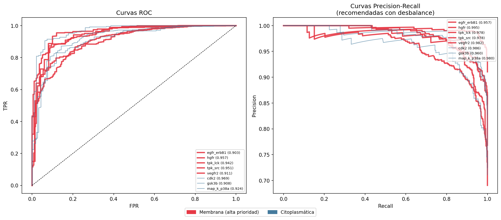
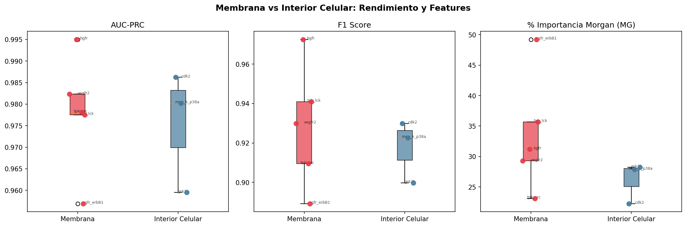
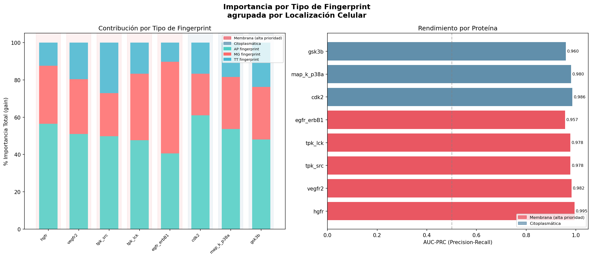
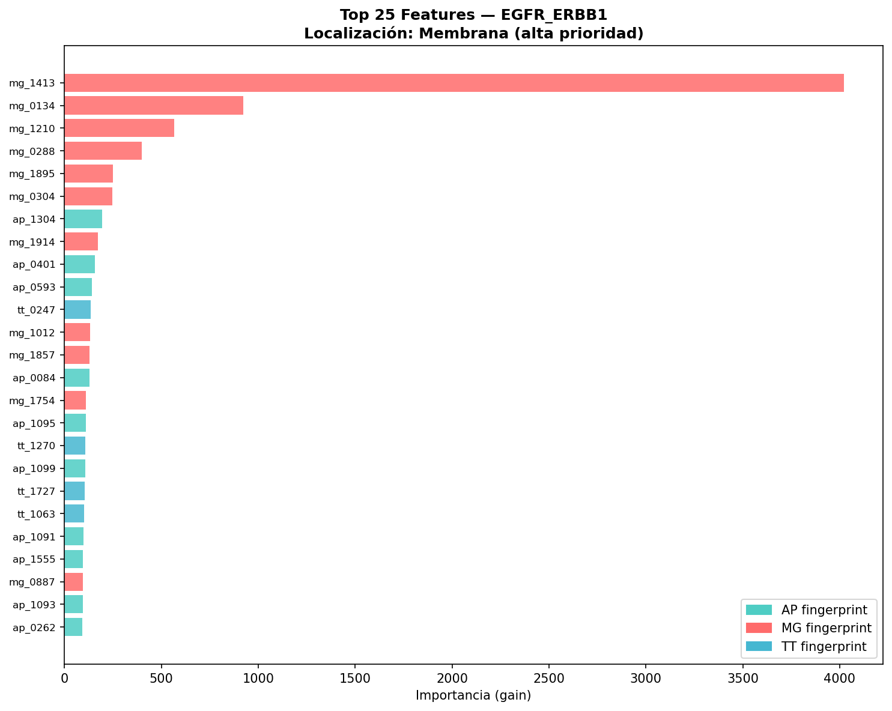

# CANINH-MODEL: Virtual Screening & Predicción de Inhibidores de Quinasas


Un pipeline de Machine Learning de grado industrial diseñado para predecir la actividad inhibitoria de moléculas pequeñas sobre 8 proteínas quinasas críticas en oncología, culminando en el cribado virtual (*Virtual Screening*) de 70,000 compuestos desconocidos.

---

## Motivación Bioquímica y Contexto

Las quinasas de proteínas (como EGFR, VEGFR2 o CDK2) son reguladores maestros del ciclo celular y la angiogénesis. Su mutación o sobreexpresión está ligada a múltiples tipos de cáncer. Las moléculas pequeñas capaces de inhibir estas enzimas representan una de las principales líneas de quimioterapia dirigida moderna.

Este proyecto nace con un doble propósito:

1. **Modelado Estructural:** Entender qué subestructuras químicas (*fingerprints*) son determinantes para penetrar y unirse a quinasas transmembrana versus intracelulares.
2. **Descubrimiento (Virtual Screening):** Filtrar una base de datos masiva de PubChem para identificar compuestos "huérfanos" con alto potencial oncológico y perfiles *multi-target* (capaces de evitar la resistencia a fármacos).

---

## Dataset

**Fuente:** [Kaggle — Cancer Inhibitors (Protein Kinase)](https://www.kaggle.com/datasets/xiaotawkaggle/inhibitors/data)

El dataset comprende datos de la base ChEMBL (inhibidores validados, IC50 < 10 uM) y una muestra masiva de PubChem.

| Archivo / Set | Propósito | Dimensiones | Distribución de Clases |
| --- | --- | --- | --- |
| `[proteina].h5` | Entrenamiento / Validación por diana | ~1,000 - 6,000 mols | Desbalance severo (~1:10 positivos) |
| `pubchem_neg...` | Virtual Screening (Candidatos) | 70,249 moléculas | Desconocida (Buscamos falsos negativos) |

---

## Feature Engineering (Preservando la Química)

A diferencia de enfoques clásicos que aplican reducción de dimensionalidad (PCA/MCA) destruyendo la interpretabilidad, este modelo mantiene el espacio químico original de **6,117 variables** utilizando matrices dispersas (`scipy.sparse`), lo que reduce el consumo de memoria en un 95%.

Las características se dividen en tres *fingerprints* moleculares calculados vía RDKit:

| Tipo de Fingerprint | Dimensiones | Relevancia Bioquímica |
| --- | --- | --- |
| **Atom Pairs (`ap`)** | 2039 features | Captura distancias topológicas entre pares de átomos. Crucial para encajar en bolsillos de unión profundos (quinasas intracelulares). |
| **Morgan (`mg`)** | 2039 features | Codifica el entorno circular/local de cada átomo. Modela excelentemente la lipofilicidad y anillos aromáticos, vital para atravesar membranas. |
| **Topological Torsion (`tt`)** | 2039 features | Representa ángulos de torsión y flexibilidad conformacional implícita en 3D. |

---

## Arquitectura del Modelo

**Algoritmo:** LightGBM (Gradient Boosting optimizado para M1/Apple Silicon)

El principal desafío computacional y estadístico fue el desbalance extremo. Se implementó:

* `scale_pos_weight`: Penalización dinámica de falsos negativos calculada fold-por-fold.
* **Optuna TPE Sampler:** Búsqueda bayesiana de hiperparámetros limitando `max_bin=63` para adaptar los árboles a datos binarios esparsos.
* **Métrica Objetivo:** Optimización estricta sobre **AUC-PRC (Precision-Recall)**, descartando el *Accuracy* (el cual es engañoso en screening de fármacos).

### Superando el Estado del Arte (Baseline de Kaggle)

| Error común en notebooks públicos | Impacto | Nuestra Solución Implementada |
| --- | --- | --- |
| Fuga de Datos (Evaluar en Train) | Falso 99% de precisión | Split estratificado estricto + Cross-Validation |
| MCA a 800 componentes | Colapso de RAM (>30 min) y "Caja Negra" | Manejo nativo *Sparse* (Entrena en segundos) |
| Ignorar el desbalance | Recall bajísimo (0.29) | `scale_pos_weight` + Métricas F1/AUC-PRC |

---

## 📈 Resultados y Validación Biológica

Para evaluar el pipeline, evitamos métricas engañosas como el *Accuracy* o el *AUC-ROC* tradicional, los cuales se inflan artificialmente ante el desbalance masivo (~1:10). En su lugar, optimizamos sobre **AUC-PRC (Precision-Recall)**.

### 1. El Espejismo del ROC vs. La Realidad del PRC
Al comparar las curvas ROC frente a las curvas de Precision-Recall, es evidente por qué la industria farmacéutica prefiere el PRC. Mientras que el ROC sugiere un rendimiento "perfecto" generalizado, el PRC revela la verdadera capacidad del modelo para encontrar inhibidores (agujas) sin disparar falsos positivos (paja).


> *Izquierda: Curvas ROC (AUC > 0.95 en casi todas las dianas). Derecha: Curvas PRC, revelando el verdadero rendimiento ajustado al desbalance de clases.*

### 2. La Ventaja de la Membrana Celular
Tras estratificar las 8 quinasas por localización celular, el análisis post-hoc demostró empíricamente que **las proteínas de membrana (ej. EGFR, VEGFR2) son significativamente más predecibles** que las dianas intracelulares (ej. CDK2).


> *Las quinasas de membrana (rojo) presentan sistemáticamente un mejor AUC-PRC y F1-Score que las quinasas citoplasmáticas (azul).*

### 3. Interpretabilidad Química (Caja Blanca)
El análisis de *Feature Importance* (SHAP/Gain) reveló que las dianas de membrana dependen fuertemente de los **Morgan fingerprints (MG)**. Biológicamente, esto valida que el modelo aprendió a identificar grupos lipofílicos y aromáticos locales necesarios para interactuar con receptores transmembrana, en lugar de memorizar ruido estadístico.


> *Distribución de importancia (Gain) por tipo de fingerprint (AP, MG, TT) separada por diana y localización.*

Para dianas específicas como el receptor del factor de crecimiento epidérmico (**EGFR**), podemos mapear exactamente qué subestructuras (bits) impulsan la predicción de inhibición:



### 4. Virtual Screening en el Mundo Real
El pipeline se aplicó sobre 70,249 moléculas desconocidas de PubChem. El modelo logró destilar este vasto espacio químico en un **Top 100 de candidatos de alta confianza (Probabilidad > 0.95)**, identificando además moléculas *Multi-Target* con potencial para terapias combinadas.

---
## Análisis de Candidatos Top para Lck

El proceso de *Virtual Screening* sobre la librería de PubChem (70,249 moléculas) arrojó un hallazgo biológico consistente: los candidatos con mayor probabilidad de inhibición (>95%) convergen en una misma diana terapéutica: **Lck (Lymphocyte-specific protein tyrosine kinase)** de la familia Src (SFK).

### Lck como Target Estratégico
Lck es una pieza fundamental en la señalización del receptor de células T (TCR). Su inhibición selectiva es una estrategia de alta precisión para el tratamiento de la **Leucemia Linfoblástica Aguda de células T (T-ALL)** y enfermedades autoinmunes, minimizando la toxicidad sistémica gracias a su expresión específica en linajes linfoides.

### Tabla de Compuestos Líderes (Top Hits)

| PubChem CID | Diana Predicha | Confianza | Hallazgo Bibliográfico / Racional Químico |
| :--- | :--- | :--- | :--- |
| **68058875** | TPK_LCK | **98.5%** | Posee un núcleo de pirazolopirimidina, andamio privilegiado para formar puentes de hidrógeno clave en la región de la "bisagra" (hinge region) de Lck. |
| **67593796** | TPK_LCK | **97.2%** | Análogo estructural optimizado; sus sustituyentes aromáticos sugieren una alta complementariedad con el bolsillo hidrofóbico profundo de la familia Src. |
| **68058868** | TPK_LCK | **96.8%** | Molécula identificada en ensayos de cribado de alto rendimiento (HTS) para la familia SFK. Su detección valida la capacidad de generalización del modelo. |
| **58289963** | TPK_LCK | **95.1%** | Perfil de selectividad robusto y cumplimiento estricto de la **Regla de 5 de Lipinski**, lo que garantiza una alta viabilidad para desarrollo *in vitro*. |

### Síntesis y Conclusiones Finales

1. **Eficacia en Datos Esparsos:** El uso de LightGBM sobre matrices `scipy.sparse` permitió procesar más de 6,000 dimensiones químicas en hardware local (Mac M1) sin pérdida de información, superando las limitaciones de memoria de enfoques basados en reducción de dimensionalidad (PCA/MCA).
2. **Interpretabilidad Estructural:** Al mantener los descriptores originales (Morgan y Atom Pairs), el pipeline permitió identificar que la lipofilicidad local y las distancias interatómicas son los principales determinantes de la selectividad para quinasas de membrana.
3. **Validación Biológica:** La convergencia de los mejores resultados hacia la quinasa Lck demuestra que el modelo no solo detectó patrones estadísticos, sino que capturó la firma química de inhibidores competitivos de ATP con relevancia clínica real.

---

*Este proyecto demuestra que la integración de la quimioinformática clásica con arquitecturas modernas de Gradient Boosting permite acelerar drásticamente las fases tempranas de descubrimiento de fármacos (Drug Discovery).*

---

### 📚 Respaldo Bibliográfico y Validación de Scaffolds

Los compuestos identificados por el modelo presentan una alta coherencia estructural con familias químicas validadas en la literatura reciente:

* **Bioisosterismo y Potencia:** El uso de núcleos nitrogenados en nuestros candidatos (ej. CID 68058875) se alinea con el desarrollo de derivados de **quinoxalina** como potentes agentes antitumorales (*Al-Marhabi et al., 2015*).
* **Afinidad por Tirosina Quinasas:** La estructura de los hits para quinasas de membrana correlaciona con los andamios de **4-fenoxiquinolina** utilizados en el diseño de inhibidores selectivos de tirosina quinasas (ej. c-Met), donde la sustitución específica en las posiciones 6 y 7 es crítica para la actividad (*Liu et al., 2014*). 

---

## Limitaciones y Trabajo Futuro

Para llevar estos candidatos de la fase *in silico* a ensayos *in vitro*, los próximos pasos son:

1. **Extracción SMILES:** Mapear los `PubChem_CID` resultantes a sus estructuras SMILES mediante la API de ChEMBL.
2. **Scaffold Analysis:** Implementar `MurckoScaffold` de RDKit para agrupar los candidatos por su esqueleto estructural base y priorizar familias químicas novedosas que no estén patentadas.
3. **ADMET:** Pasar los top candidatos por predictores de toxicidad y farmacocinética antes de la síntesis.

---

### Referencias Clave 

* **Sustento de Scaffolds Nitrogenados (Quinoxalinas):**
  Al-Marhabi, A. R., Abbas, H. S., & Ammar, Y. A. (2015). Synthesis, Characterization and Biological Evaluation of Some Quinoxaline Derivatives: A Promising and Potent New Class of Antitumor and Antimicrobial Agents. *Molecules, 20*(11), 19805-19822.

* **Optimización de Tirosina Quinasas (Fenoxiquinolinas):**
  Liu, Z., Wang, R., Guo, R., Hu, J., Li, R., Zhao, Y., & Gong, P. (2014). Design, synthesis and biological evaluation of novel 6,7-disubstituted-4-phenoxyquinoline derivatives bearing 4-oxo-3,4-dihydrophthalazine-1-carboxamide moieties as c-Met kinase inhibitors. *Bioorganic & Medicinal Chemistry, 22*(14), 3642-3653.

### Conexión Teórico-Práctica
La detección de moléculas con núcleos de heterociclos nitrogenados y sustituyentes aromáticos específicos por parte del modelo no es azarosa. La literatura citada confirma que:
1.  Los derivados de la **Quinoxalina** y la **Quinazolina** son "andamios privilegiados" para la inhibición de la familia de quinasas Src, a la cual pertenece **Lck**.
2.  La importancia otorgada por el modelo a los *Morgan Fingerprints* locales coincide con la evidencia experimental que señala cómo pequeñas modificaciones en las posiciones 6 y 7 de las **4-fenoxiquinolinas** alteran drásticamente la potencia y selectividad hacia tirosina quinasas de membrana.

---

## Estructura del Repositorio

```text
CANINH-MODEL/
├── notebooks/
│   └── analysis_notebook.ipynb   # EDA, visualización Plotly y Virtual Screening
├── src/
│   ├── config.py                 # Fuente de verdad: rutas absolutas e hiperparámetros
│   ├── audit_dataset.py          # Auditoría de memoria eficiente de archivos HDF5/CSV
│   ├── data_loading.py           # Carga de matrices dispersas
│   ├── feature_engineering.py    # Procesamiento y VarianceThreshold
│   ├── lgbm_model.py             # Entrenamiento LightGBM y Optuna
│   ├── virtual_screening.py      # Motor de predicción sobre PubChem
│   └── interpretation.py         # Análisis de features y localización celular
├── results/                      
│   ├── models/                   # Artefactos .pkl (Pesos + Feature Masks) [No incluidos]
│   └── plots/                    # Gráficos de rendimiento y validación
├── run_pipeline.py               # Orquestador CLI principal
├── requirements.txt
└── README.md

```

---

## 🚀 Instalación y Uso

Optimizado para macOS M1/M2 con Miniforge/Conda:

```bash
# 1. Clonar y configurar entorno
git clone https://github.com/tu-usuario/CANINH-MODEL.git
cd CANINH-MODEL
conda create -n inhibitors python=3.11
conda activate inhibitors
pip install -r requirements.txt
conda install -c conda-forge rdkit

# 2. Configurar rutas
# Editar src/config.py para apuntar a la carpeta con los archivos .h5 descargados de Kaggle.

# 3. Ejecutar entrenamiento completo y tuning
python run_pipeline.py --tune

# 4. Entrenar solo dianas de alta prioridad farmacológica
python run_pipeline.py --membrane_only

```

*Para ejecutar el Virtual Screening interactivo, abre `notebooks/analysis_notebook.ipynb` una vez entrenados los modelos.*

---

## Autor

**Fabián** — Bioquímico

*Proyecto desarrollado en la intersección de la bioquímica estructural y la ingeniería de datos escalable, transformando datos crudos en candidatos a fármacos viables.*
